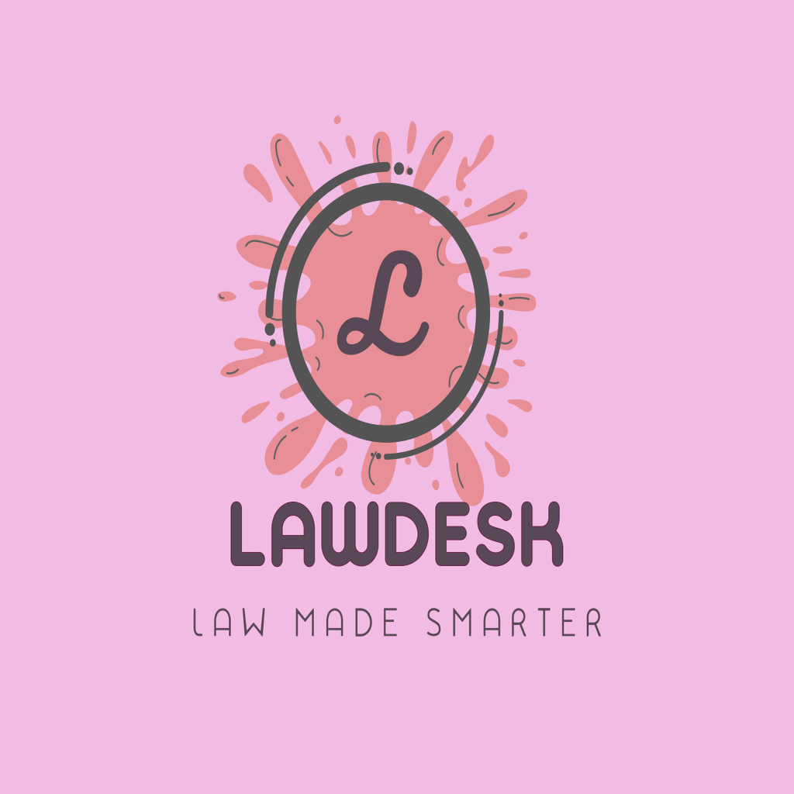
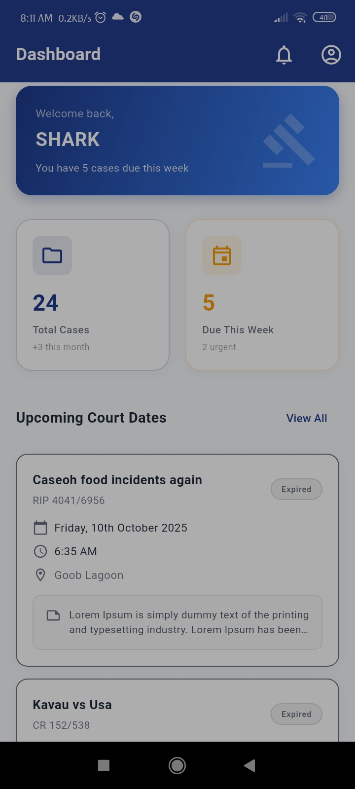
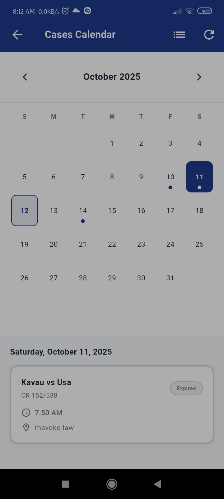
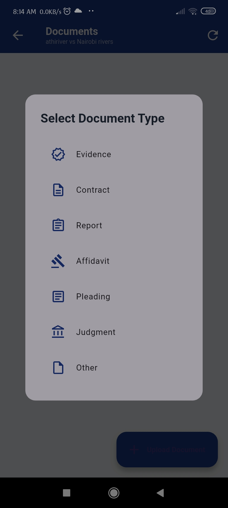

# LawDesk - Legal Case Management System

  
  
  ### Law Made Smarter
  
  
  
  
  

## 📱 About

LawDesk is a modern, mobile-first case management system designed specifically for legal professionals in Kenya. Built to help lawyers track cases, manage court dates, organize documents, and never miss a deadline.

### ✨ Key Features

- **📅 Smart Calendar** - Visual court date tracking with urgent/expired case indicators
- **📂 Document Management** - Categorized document storage (Evidence, Contracts, Affidavits, etc.)
- **⚖️ Case Tracking** - Complete case lifecycle management with status tracking
- **🔔 Reminders** - Automated notifications for upcoming court dates
- **🔐 Secure Authentication** - User accounts with profile management
- **📊 Dashboard** - At-a-glance overview of cases and upcoming deadlines
- **🔍 Search & Filter** - Quick access to cases and documents
- **📱 Mobile-First** - Designed for lawyers on the go

## 🚀 Screenshots

  
  
  

## 🛠️ Tech Stack

- **Framework:** Flutter 3.0+
- **Language:** Dart
- **Backend:** Supabase (PostgreSQL + Storage)
- **Authentication:** Supabase Auth
- **State Management:** Provider / setState
- **Local Storage:** Shared Preferences
- **File Storage:** Supabase Storage with Row Level Security

## 📦 Installation

### Prerequisites

- Flutter SDK (3.0 or higher)
- Dart SDK (2.17 or higher)
- Android Studio / VS Code / Neovim
- Git

