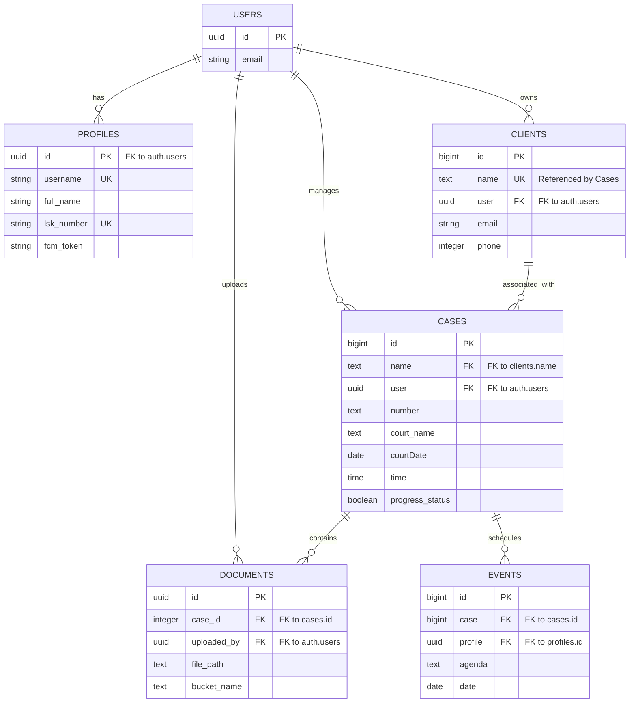

---

# LawDesk Developer Documentation

## Index

* [Chapter 1: Project Introduction and Setup](#chapter-1-project-introduction-and-setup)
* [Chapter 2: Data Modeling](#chapter-2-data-modeling)
* [Chapter 3: Local Database Implementation](#chapter-3-local-database-implementation)
* [Chapter 4: Authentication Services](#chapter-4-authentication-services)
* [Chapter 5: Case Management](#chapter-5-case-management)
* [Chapter 6: User Interface](#chapter-6-user-interface)

---

## Chapter 1: Project Introduction and Setup

### Project Overview

LawDesk is a Flutter based android mobile application designed for managing and diarising legal cases. The app utilises supabase as its backend service for authentication and data storage. Notifications are handled through a custom cron job setup.

The cron job initiates a serverless edge function which sends push notifications trigger to firebase cloud messaging which then delivers the notifications to the users devices which each has a specific fcm token.

**_What is an FCM Token?_**: It is a unique identifier assigned to each device by Firebase Cloud Messaging (FCM). This token allows the FCM service to route notifications specifically to that device. It also handles offline notifications by queuing them until the device is back online.

The application also handles document upload and storage using supabase storage buckets. View of documents is also possible using the [flutter_pdfview](https://pub.dev/packages/flutter_pdfview) package and the [photo_view](https://pub.dev/packages/photo_view) packages for pdf and Image views respectively.

Offline capabilities are provided through storing data locally using the [shared_preferences](https://pub.dev/packages/shared_preferences) package. This is not the most optimal solution for large data sets but works well for small scale usage. A better solution must be implemented in future versions using [sqlite](https://pub.dev/packages/sqlite) or hive databases.

OTA UPDATES: The app is capable of recieving over the air updates by using [shorebird_code_push](https://pub.dev/packages/shorebird_code_push) package. This allows for quick bug fixes and feature releases without going through the lengthy play store review process. **_Note: While building a patch for the app, ensure to use the code below to avoid issues with icon tree shaking which causes loss of icons pushed via the update._**

```powershell
shorebird patch android '--' --no-tree-shake-icons

```

while for bash use

```bash
shorebird patch android -- --no-tree-shake-icons

```

Other packages used in the project include:

- [provider](https://pub.dev/packages/provider) - State Management
- [intl](https://pub.dev/packages/intl) - Date Formatting
- [connectivity_plus](https://pub.dev/packages/connectivity_plus) - Network Connectivity Checks
- [delightful_toast](https://pub.dev/packages/delightful_toast) - Toast notifications
- [image_picker](https://pub.dev/packages/image_picker) - Image selection from gallery or camera
- [introduction_screen](https://pub.dev/packages/introduction_screen) - Onboarding screens
- [flutter_launcher_icons](https://pub.dev/packages/flutter_launcher_icons) - App icon generation
- [liquid_pull_to_refresh](https://pub.dev/packages/liquid_pull_to_refresh) - Pull to refresh functionality
- [flutter_local_notifications](https://pub.dev/packages/flutter_local_notifications) - Local notifications have been implemented but not yet in use. It's still buggy and unreliable.
- [Firebase_core](https://pub.dev/packages/firebase_core) - Core firebase functionalities.
- [firebase_messaging](https://pub.dev/packages/firebase_messaging) - Firebase integration for push notifications.
- [url_launcher](https://pub.dev/packages/url_launcher) - To open contact information with relevant apps in the clients page.

### Establishing the Environment and Dependencies

This chapter outlines the initial setup required to get the development environment ready for building the LawDesk application. It includes project creation, dependency management, and configuration steps.
Kindly follow the steps shown in the [README.md](https://github.com/andareomondi/lawdesk/blob/main/README.md) file of the project. This does not include setting up the supabase backend. This will be show in a future chapter.

**Future Improvements:**

- Migrate to a specific Flutter version manager (FVM) to ensure team consistency.
- Set up Flavors (Dev, Staging, Prod) in the Gradle configuration.

---

## Chapter 2: Data Modeling

### Defining the Case Entity

This chapter details the structure of the `Case` object. It serves as the core data unit for the application in which everything else is build around.

### Implementation

#### 1. The Case Model Class

This is the sql representation of a legal case in the application. It includeds fields for id, created_at, name, number, status, description, courtDate, court_name, time, progress_status and user. The fields `name` and `user` are foreign keys linked to the clients and users tables respectively.

```sql

create table public.cases (
  id bigint generated by default as identity not null,
  created_at timestamp with time zone not null default now(),
  name text null,
  number text null,
  court_name text null,
  status text null,
  "courtDate" date null,
  time time without time zone null,
  description text null,
  "user" uuid null,
  progress_status boolean null default false,
  constraint cases_pkey primary key (id),
  constraint cases_name_fkey foreign KEY (name) references clients (name) on delete CASCADE,
  constraint cases_user_fkey foreign KEY ("user") references auth.users (id) on delete CASCADE
) TABLESPACE pg_default;

```

**_Note1:_** The fields `status` and `progress_status` are used to track the state of the case. `status` is a string that can hold values like 'Urgent', 'No worries', 'Upcoming', etc. in respective to the court date and the days date, while `progress_status` is a boolean indicating whether the case is actively being worked on.

**_Note2:_** The field `courtDate` is of type date which only stores the date without the time component. The field `time` is used to store the specific time of the court hearing.

**_Note3:_** The field `user` is a foreign key that references the `id` field in the `auth.users` table. This links each case to a specific user account.

**_Note4:_** The field `name` is a foreign key that references the `name` field in the `clients` table. This links each case to a specific client.

**_Note5:_** Cascade delete is enabled on both foreign keys to ensure that when a user or client is deleted, all associated cases are also removed from the database.

---

**Future Improvements:**

- Add indexing on frequently queried fields like `status` and `courtDate` to improve query performance.
- Implement data validation logic within the model to ensure data integrity.
- Implement a better `status` tracking mechanism.

##### **_MUST:_** Implement a billing mechanism to track billable hours per case.

### Defining of other Entities and tables

Other important entities such as `Client`, `Document`, `Events`, `Profiles` and `Court` sql representation are as follows:

**_Clients Table:_**

```sql

create table public.clients (
  id bigint generated by default as identity not null,
  created_at timestamp with time zone not null default now(),
  name text null,
  email text null,
  notes text null,
  phone integer null,
  "user" uuid null,
  constraint clients_pkey primary key (id),
  constraint clients_name_key unique (name),
  constraint clients_user_fkey foreign KEY ("user") references auth.users (id) on delete CASCADE
) TABLESPACE pg_default;

```

**_Documents Table:_**

```sql
create table public.documents (
  id uuid not null default gen_random_uuid (),
  case_id integer not null,
  uploaded_by uuid null,
  file_name text not null,
  file_path text not null,
  file_size integer null,
  mime_type text null,
  document_type text null,
  bucket_name text null default 'case_documents'::text,
  created_at timestamp with time zone null default now(),
  updated_at timestamp with time zone null default now(),
  public_url text null,
  constraint documents_pkey primary key (id),
  constraint documents_case_id_fkey foreign KEY (case_id) references cases (id) on delete CASCADE,
  constraint documents_uploaded_by_fkey foreign KEY (uploaded_by) references auth.users (id)
) TABLESPACE pg_default;

create trigger on_document_delete_remove_storage BEFORE DELETE on documents for EACH row
execute FUNCTION delete_document_storage ();

```

**_Events Table:_**

```sql

create table public.events (
  id bigint generated by default as identity not null,
  created_at timestamp with time zone not null default now(),
  agenda text null,
  date date null,
  time time without time zone null,
  "case" bigint null,
  profile uuid null,
  constraint events_pkey primary key (id),
  constraint events_case_fkey foreign KEY ("case") references cases (id) on delete CASCADE,
  constraint events_profile_fkey foreign KEY (profile) references profiles (id) on delete CASCADE
) TABLESPACE pg_default;

```

**_Profiles Table:_**

```sql

create table public.profiles (
  id uuid not null,
  updated_at timestamp with time zone null,
  username text null,
  full_name text null,
  gender text null,
  email text null,
  is_admin boolean null,
  is_updated boolean null default false,
  lsk_number text null,
  fcm_token text null,
  constraint profiles_pkey primary key (id),
  constraint profiles_lsk_number_key unique (lsk_number),
  constraint profiles_username_key unique (username),
  constraint profiles_id_fkey foreign KEY (id) references auth.users (id) on delete CASCADE,
  constraint username_length check ((char_length(username) >= 3))
) TABLESPACE pg_default;

```

**_Courts Table:_**

```sql

create table public.court (
  id bigint generated by default as identity not null,
  created_at timestamp with time zone not null default now(),
  name text null,
  constraint court_pkey primary key (id),
  constraint court_name_key unique (name)
) TABLESPACE pg_default;


```

Below is a simple ER diagram showing the relationships between the main entities in the application.



---

## Chapter 3: Local Database Implementation

### Persisting Data with local storage

This chapter explains the setup of the local storage layer. It handles the creation of tables and the raw CRUD (Create, Read, Update, Delete) operations required for offline functionality.
The whole system comprises of a offline service which "caches" the data into local storage and then retrived by the respective widget

### Implementation

#### 1. Service Initialization

This code opens the service and should be called in the [main.dart](https://github.com/andareomondi/lawdesk/blob/main/lib/main.dart) file during the on start of the applicaton.

```dart

import 'dart:convert';
import 'package:shared_preferences/shared_preferences.dart';

class OfflineStorageService {
  static final OfflineStorageService _instance = OfflineStorageService._internal();
  factory OfflineStorageService() => _instance;
  OfflineStorageService._internal();

  static const String _casesCacheKey = 'cached_cases';
  static const String _profileCacheKey = 'cached_profile';
  static const String _statsCacheKey = 'cached_stats';
  static const String _documentsCacheKey = 'cached_documents';
  static const String _eventsCacheKey = 'cached_events';
  static const String _clientsCacheKey = 'cached_clients'; // Added clients key
  static const String _lastSyncKey = 'last_sync_time';

  // Save clients to local storage
  Future<void> cacheClients(List<dynamic> clients) async {
    try {
      final prefs = await SharedPreferences.getInstance();
      final jsonString = jsonEncode(clients);
      await prefs.setString(_clientsCacheKey, jsonString);
      await _updateLastSyncTime();
      print('Successfully cached ${clients.length} clients');
    } catch (e) {
      print('Error caching clients: $e');
    }
  }

  // Get cached clients
  Future<List<dynamic>?> getCachedClients() async {
    try {
      final prefs = await SharedPreferences.getInstance();
      final jsonString = prefs.getString(_clientsCacheKey);
      if (jsonString != null) {
        return jsonDecode(jsonString) as List<dynamic>;
      }
    } catch (e) {
      print('Error getting cached clients: $e');
    }
    return null;
  }

  // Save events to local storage
  Future<void> cacheEvents(List<dynamic> events) async {
    try {
      final prefs = await SharedPreferences.getInstance();
      final jsonString = jsonEncode(events);
      await prefs.setString(_eventsCacheKey, jsonString);
      await _updateLastSyncTime();
      print('Successfully cached ${events.length} events');
    } catch (e) {
      print('Error caching events: $e');
    }
  }

  // Get cached events
  Future<List<dynamic>?> getCachedEvents() async {
    try {
      final prefs = await SharedPreferences.getInstance();
      final jsonString = prefs.getString(_eventsCacheKey);
      if (jsonString != null) {
        return jsonDecode(jsonString) as List<dynamic>;
      }
    } catch (e) {
      print('Error getting cached events: $e');
    }
    return null;
  }

  // Save cases to local storage
  Future<void> cacheCases(List<dynamic> cases) async {
    try {
      final prefs = await SharedPreferences.getInstance();
      final jsonString = jsonEncode(cases);
      await prefs.setString(_casesCacheKey, jsonString);
      await _updateLastSyncTime();
      print('Successfully cached ${cases.length} cases');
    } catch (e) {
      print('Error caching cases: $e');
    }
  }

  // Get cached cases
  Future<List<dynamic>?> getCachedCases() async {
    try {
      final prefs = await SharedPreferences.getInstance();
      final jsonString = prefs.getString(_casesCacheKey);
      if (jsonString != null) {
        return jsonDecode(jsonString) as List<dynamic>;
      }
    } catch (e) {
      print('Error getting cached cases: $e');
    }
    return null;
  }

  // Save documents to local storage
  Future<void> cacheDocuments(List<dynamic> documents) async {
    try {
      final prefs = await SharedPreferences.getInstance();
      final jsonString = jsonEncode(documents);
      await prefs.setString(_documentsCacheKey, jsonString);
      await _updateLastSyncTime();
      print('Successfully cached ${documents.length} documents');
    } catch (e) {
      print('Error caching documents: $e');
    }
  }

  // Get cached documents
  Future<List<dynamic>?> getCachedDocuments() async {
    try {
      final prefs = await SharedPreferences.getInstance();
      final jsonString = prefs.getString(_documentsCacheKey);
      if (jsonString != null) {
        return jsonDecode(jsonString) as List<dynamic>;
      }
    } catch (e) {
      print('Error getting cached documents: $e');
    }
    return null;
  }

  // Save profile to local storage
  Future<void> cacheProfile(Map<String, dynamic> profile) async {
    try {
      final prefs = await SharedPreferences.getInstance();
      final jsonString = jsonEncode(profile);
      await prefs.setString(_profileCacheKey, jsonString);
      await _updateLastSyncTime();
    } catch (e) {
      print('Error caching profile: $e');
    }
  }

  // Get cached profile
  Future<Map<String, dynamic>?> getCachedProfile() async {
    try {
      final prefs = await SharedPreferences.getInstance();
      final jsonString = prefs.getString(_profileCacheKey);
      if (jsonString != null) {
        return jsonDecode(jsonString) as Map<String, dynamic>;
      }
    } catch (e) {
      print('Error getting cached profile: $e');
    }
    return null;
  }

  // Save stats to local storage
  Future<void> cacheStats(Map<String, dynamic> stats) async {
    try {
      final prefs = await SharedPreferences.getInstance();
      final jsonString = jsonEncode(stats);
      await prefs.setString(_statsCacheKey, jsonString);
    } catch (e) {
      print('Error caching stats: $e');
    }
  }

  // Get cached stats
  Future<Map<String, dynamic>?> getCachedStats() async {
    try {
      final prefs = await SharedPreferences.getInstance();
      final jsonString = prefs.getString(_statsCacheKey);
      if (jsonString != null) {
        return jsonDecode(jsonString) as Map<String, dynamic>;
      }
    } catch (e) {
      print('Error getting cached stats: $e');
    }
    return null;
  }

  // Update last sync time
  Future<void> _updateLastSyncTime() async {
    final prefs = await SharedPreferences.getInstance();
    await prefs.setString(_lastSyncKey, DateTime.now().toIso8601String());
  }

  // Get last sync time
  Future<DateTime?> getLastSyncTime() async {
    try {
      final prefs = await SharedPreferences.getInstance();
      final timeString = prefs.getString(_lastSyncKey);
      if (timeString != null) {
        return DateTime.parse(timeString);
      }
    } catch (e) {
      print('Error getting last sync time: $e');
    }
    return null;
  }

  // Clear all cached data
  Future<void> clearCache() async {
    final prefs = await SharedPreferences.getInstance();
    await prefs.remove(_casesCacheKey);
    await prefs.remove(_profileCacheKey);
    await prefs.remove(_statsCacheKey);
    await prefs.remove(_documentsCacheKey);
    await prefs.remove(_eventsCacheKey);
    await prefs.remove(_clientsCacheKey); // Added clear for clients
    await prefs.remove(_lastSyncKey);
  }
}

final offlineStorage = OfflineStorageService();

```

#### 2. Service recall example

This is an example of how to use the service to obtain the cached data and to cache which ever is applicable. The sample code is retrived from the dashboard stat card that shows the total active number of cases and their diffrence.

```dart

  Future<void> loadStats() async {
    try {
      setState(() {
        _isLoading = true;
        _errorMessage = null;
      });

      final user = _supabase.auth.currentUser;
      if (user == null) {
        throw Exception('User not authenticated');
      }

      // Check if online
      if (connectivityService.isConnected) {
        // Fetch all cases for the user from server
        final response = await _supabase
            .from('cases')
            .select()
            .eq('user', user.id);

        if (response is List) {
          final cases = List<Map<String, dynamic>>.from(response);
          final statsData = _processStatsData(cases);

          setState(() {
            _statsData = statsData;
            _isLoading = false;
          });

          // Cache the stats
          await offlineStorage.cacheStats({
            'totalCases': statsData.totalCases,
            'monthlyIncrease': statsData.monthlyIncrease,
            'dueThisWeek': statsData.dueThisWeek,
            'urgentCases': statsData.urgentCases,
          });

          // Also cache the cases data for consistency
          await offlineStorage.cacheCases(cases);
        }
      } else {
        // Load from cache when offline
        final cachedStats = await offlineStorage.getCachedStats();

        if (cachedStats != null) {
          setState(() {
            _statsData = StatsData(
              totalCases: cachedStats['totalCases'] ?? 0,
              monthlyIncrease: cachedStats['monthlyIncrease'] ?? 0,
              dueThisWeek: cachedStats['dueThisWeek'] ?? 0,
              urgentCases: cachedStats['urgentCases'] ?? 0,
            );
            _isLoading = false;
          });
        } else {
          // No cached data available
          setState(() {
            _errorMessage = 'No offline data available';
            _isLoading = false;
          });
        }
      }
    } catch (e) {
      print('Error loading stats: $e');

      // Try to load from cache on error
      final cachedStats = await offlineStorage.getCachedStats();

      if (cachedStats != null && mounted) {
        setState(() {
          _statsData = StatsData(
            totalCases: cachedStats['totalCases'] ?? 0,
            monthlyIncrease: cachedStats['monthlyIncrease'] ?? 0,
            dueThisWeek: cachedStats['dueThisWeek'] ?? 0,
            urgentCases: cachedStats['urgentCases'] ?? 0,
          );
          _isLoading = false;
        });
      } else {
        setState(() {
          _errorMessage = 'Failed to load stats';
          _isLoading = false;
        });
      }
    }
  }

```

**_NOTE1:_** Similar logic is implemented across the app to cache and retrieve data for cases, profile, documents, events and clients. And don't forget to import the `offline_storage_service.dart` file wherever you intend to use it.

**_NOTE2:_** A sync method is implemented in the app to retrive the actual data from supabase when the device is online. This is done seemlessly and with a visual feeback

---

**Future Improvements:**

- Implement a more robust local database solution using SQLite or Hive for complex queries and relationships.
- Clean up the service if deemed to be the only option to go with in production

---

## Chapter 4: Authentication Services

### User Session Management

This chapter focuses on the authentication layer of the application. It outlines the base service implemented, logic for supabase authentication, user interface for auth services and session persistence. We have a centralized auth service which implements the predefined supabase configuration and the auth provider logic.

Here is the supabase configuration used in the app:
`supabase_config.dart`

```dart
import 'package:supabase_flutter/supabase_flutter.dart';

class SupabaseConfig {
  static Future<void> initialize() async {
    await Supabase.initialize(
    // TODO: Implement a env setup with the configurations set to there
      url: 'YOUR_SUPABASE_URL',
      anonKey: 'YOUR_SUPABASE_ANON_KEY',
    );
  }

  static SupabaseClient get client => Supabase.instance.client;
}

```

This is just but the standard supabase initialization code. Make sure to replace the url and anonKey with your actual supabase project credentials. This also must be called in the [main.dart](https://github.com/andareomondi/lawdesk/blob/main/lib/main.dart) file during app startup in the main function before running the app.

This is the implementation of the auth service interface and its implementation in the auth provider layer.
`auth_service.dart`

```dart
import 'package:supabase_flutter/supabase_flutter.dart';
import 'package:lawdesk/config/supabase_config.dart';

class AuthService {
  final SupabaseClient _client = SupabaseConfig.client;

  // Check if user is currently logged in
  bool get isLoggedIn => _client.auth.currentSession != null;

  // Get current user
  User? get currentUser => _client.auth.currentUser;

  // Sign up with email and password
  Future<void> signUp({
    required String email,
    required String password,
  }) async {
      await _client.auth.signUp(email: email, password: password);
  }

  // Sign in with email and password
  Future<void> signIn({
    required String email,
    required String password,
  }) async {
      await _client.auth.signInWithPassword(email: email, password: password);
  }

  // Sign out
  Future<void> signOut() async {
    try {
      await _client.auth.signOut();
    } catch (e) {
      throw Exception('Sign out failed: $e');
    }
  }
}

```

while the `auth_provider.dart` file implements the provider logic as follows:

```dart

import 'package:flutter/material.dart';
import 'package:supabase_flutter/supabase_flutter.dart';
import 'package:lawdesk/services/auth_service.dart';

class AuthProvider extends ChangeNotifier {
  final AuthService _authService = AuthService();

  User? _user;
  bool _isLoading = false;
  bool _isInitializing = true;

  // Getters
  User? get user => _user;
  bool get isLoggedIn => _user != null;
  bool get isLoading => _isLoading;
  bool get isInitializing => _isInitializing;

  AuthProvider() {
    _initialize();
  }

  // Initialize: check if user is already logged in on app startup
  Future<void> _initialize() async {
    _isInitializing = true;
    notifyListeners();

    try {
      _user = _authService.currentUser;
    } catch (e) {
      print('Error initializing auth: $e');
    }

    _isInitializing = false;
    notifyListeners();
  }

  // Sign up
  Future<void> signUp({
    required String email,
    required String password,
  }) async {
    _isLoading = true;
    notifyListeners();
    // TODO: Add email validation and checking if email is already in use

    try {
      await _authService.signUp(email: email, password: password);
      _user = _authService.currentUser;
      notifyListeners();
    } catch (e) {
      print('Sign up error: $e');
      rethrow;
    } finally {
      _isLoading = false;
      notifyListeners();
    }
  }

  // Sign in
  Future<void> signIn({
    required String email,
    required String password,
  }) async {
    _isLoading = true;
    notifyListeners();

    try {
      await _authService.signIn(email: email, password: password);
      _user = _authService.currentUser;
      notifyListeners();
    } catch (e) {
      print('Sign in error: $e');
      rethrow;
    } finally {
      _isLoading = false;
      notifyListeners();
    }
  }

  // Sign out
  Future<void> signOut() async {
    _isLoading = true;
    notifyListeners();

    try {
      await _authService.signOut();
      _user = null;
      notifyListeners();
    } catch (e) {
      print('Sign out error: $e');
      rethrow;
    } finally {
      _isLoading = false;
      notifyListeners();
    }
  }
}

```

### Implementation

#### 1. Login Service Interface

This shows how the login mechanism and user interface implemetation is done and how they work together.

[`login_screen.dart`](https://github.com/andareomondi/lawdesk/blob/main/lib/screens/auth/login_screen.dart)

```dart
// Login function inside the page
  Future<void> _handleLogin() async {
    if (!_formKey.currentState!.validate()) return;

    setState(() => _isLoading = true);

    try {
      final authProvider = context.read<AuthProvider>();
      await authProvider.signIn(
        email: _emailController.text.trim(),
        password: _passwordController.text,
      );
    } on AuthException catch (e) {
      // Handle Supabase authentication errors
      if (mounted) {
        String errorMessage;

        // Check for invalid credentials
        if (e.statusCode == '400' ||
            e.message.toLowerCase().contains('invalid') ||
            e.message.toLowerCase().contains('credentials')) {
          errorMessage = 'Invalid email or password. Please try again.';
        } else if (e.message.toLowerCase().contains('email not confirmed')) {
          errorMessage = 'Please verify your email before logging in.';
        } else {
          errorMessage = "An error occured during logging in. Please try again.";
        }
        AppToast.showError(
          context: context,
          title: 'Login Failed',
          message: errorMessage,
        );
      }
    } catch (e) {
      // Handle any other unexpected errors
      if (mounted) {
        AppToast.showError(
          context: context,
          title: 'Login Failed',
          message: 'An unexpected error occurred. Please try again.',
        );
      }
    } finally {
      if (mounted) {
        setState(() => _isLoading = false);
      }
    }
  }

// Widget build method snippet
  @override
  Widget build(BuildContext context) {
    return Scaffold(
      backgroundColor: const Color(0xFFF8FAFC),
      body: SafeArea(
        child: Center(
          child: SingleChildScrollView(
            padding: const EdgeInsets.all(24.0),
            child: Column(
              mainAxisAlignment: MainAxisAlignment.center,
              children: [
                // Logo and title
                Container(
                  padding: const EdgeInsets.all(16),
                  decoration: BoxDecoration(
                    color: const Color(0xFF1E3A8A),
                    borderRadius: BorderRadius.circular(16),
                  ),
                  child: const Icon(
                    Icons.gavel,
                    size: 48,
                    color: Colors.white,
                  ),
                ),
                const SizedBox(height: 24),
                const Text(
                  'LawDesk',
                  style: TextStyle(
                    fontSize: 32,
                    fontWeight: FontWeight.bold,
                    color: Color(0xFF1E3A8A),
                  ),
                ),
                const SizedBox(height: 8),
                const Text(
                  'Welcome back! Sign in to continue',
                  style: TextStyle(
                    fontSize: 14,
                    color: Color(0xFF6B7280),
                  ),
                  textAlign: TextAlign.center,
                ),
                const SizedBox(height: 40),

                // Login form
                Container(
                  padding: const EdgeInsets.all(24),
                  decoration: BoxDecoration(
                    color: Colors.white,
                    borderRadius: BorderRadius.circular(16),
                    boxShadow: [
                      BoxShadow(
                        color: Colors.black.withOpacity(0.05),
                        blurRadius: 10,
                        offset: const Offset(0, 4),
                      ),
                    ],
                  ),
                  child: Form(
                    key: _formKey,
                    child: Column(
                      crossAxisAlignment: CrossAxisAlignment.stretch,
                      children: [
                        // Email field
                        TextFormField(
                          controller: _emailController,
                          keyboardType: TextInputType.emailAddress,
                          textInputAction: TextInputAction.next,
                          decoration: InputDecoration(
                            labelText: 'Email',
                            hintText: 'you@example.com',
                            prefixIcon: const Icon(Icons.email_outlined),
                            border: OutlineInputBorder(
                              borderRadius: BorderRadius.circular(12),
                            ),
                            enabledBorder: OutlineInputBorder(
                              borderRadius: BorderRadius.circular(12),
                              borderSide: const BorderSide(color: Color(0xFFE5E7EB)),
                            ),
                            focusedBorder: OutlineInputBorder(
                              borderRadius: BorderRadius.circular(12),
                              borderSide: const BorderSide(color: Color(0xFF1E3A8A), width: 2),
                            ),
                          ),
                          validator: (value) {
                            if (value == null || value.isEmpty) {
                              return 'Please enter your email';
                            }
                            if (!EmailValidator.validate(value)) {
                              return 'Please enter a valid email';
                            }
                            return null;
                          },
                        ),
                        const SizedBox(height: 16),

                        // Password field
                        TextFormField(
                          controller: _passwordController,
                          obscureText: !_isPasswordVisible,
                          textInputAction: TextInputAction.done,
                          onFieldSubmitted: (_) => _handleLogin(),
                          decoration: InputDecoration(
                            labelText: 'Password',
                            hintText: 'Enter your password',
                            prefixIcon: const Icon(Icons.lock_outlined),
                            suffixIcon: IconButton(
                              icon: Icon(
                                _isPasswordVisible ? Icons.visibility_off : Icons.visibility,
                              ),
                              onPressed: () {
                                setState(() => _isPasswordVisible = !_isPasswordVisible);
                              },
                            ),
                            border: OutlineInputBorder(
                              borderRadius: BorderRadius.circular(12),
                            ),
                            enabledBorder: OutlineInputBorder(
                              borderRadius: BorderRadius.circular(12),
                              borderSide: const BorderSide(color: Color(0xFFE5E7EB)),
                            ),
                            focusedBorder: OutlineInputBorder(
                              borderRadius: BorderRadius.circular(12),
                              borderSide: const BorderSide(color: Color(0xFF1E3A8A), width: 2),
                            ),
                          ),
                          validator: (value) {
                            if (value == null || value.isEmpty) {
                              return 'Please enter your password';
                            }
                            if (value.length < 6) {
                              return 'Password must be at least 6 characters';
                            }
                            return null;
                          },
                        ),
                        const SizedBox(height: 8),

                        // Forgot password
                        // Align(
                        //   alignment: Alignment.centerRight,
                        //   child: TextButton(
                        //     onPressed: () {
                        //       Navigator.push(context, MaterialPageRoute(builder: (context) => const ForgotPasswordPage()),);
                        //     },
                        //     style: TextButton.styleFrom(
                        //       padding: const EdgeInsets.symmetric(horizontal: 8, vertical: 4),
                        //     ),
                        //     child: const Text(
                        //       'Forgot Password?',
                        //       style: TextStyle(
                        //         color: Color(0xFF1E3A8A),
                        //         fontSize: 13,
                        //       ),
                        //     ),
                        //   ),
                        // ),
                        // const SizedBox(height: 24),

                        // Login button
                        ElevatedButton(
                          onPressed: _isLoading ? null : _handleLogin,
                          style: ElevatedButton.styleFrom(
                            backgroundColor: const Color(0xFF1E3A8A),
                            foregroundColor: Colors.white,
                            padding: const EdgeInsets.symmetric(vertical: 16),
                            shape: RoundedRectangleBorder(
                              borderRadius: BorderRadius.circular(12),
                            ),
                            elevation: 2,
                          ),
                          child: _isLoading
                              ? const SizedBox(
                                  height: 20,
                                  width: 20,
                                  child: CircularProgressIndicator(
                                    strokeWidth: 2,
                                    valueColor: AlwaysStoppedAnimation<Color>(Colors.white),
                                  ),
                                )
                              : const Text(
                                  'Sign In',
                                  style: TextStyle(
                                    fontSize: 16,
                                    fontWeight: FontWeight.w600,
                                  ),
                                ),
                        ),
                      ],
                    ),
                  ),
                ),
                const SizedBox(height: 24),

                // Sign up link
                Row(
                  mainAxisAlignment: MainAxisAlignment.center,
                  children: [
                    const Text(
                      "Don't have an account? ",
                      style: TextStyle(
                        color: Color(0xFF6B7280),
                        fontSize: 14,
                      ),
                    ),
                    TextButton(
                      onPressed: () {
                        Navigator.push(
                          context,
                          MaterialPageRoute(builder: (context) => const SignupPage()),
                        );
                      },
                      style: TextButton.styleFrom(
                        padding: const EdgeInsets.symmetric(horizontal: 8),
                      ),
                      child: const Text(
                        'Sign Up',
                        style: TextStyle(
                          color: Color(0xFF1E3A8A),
                          fontSize: 14,
                          fontWeight: FontWeight.w600,
                        ),
                      ),
                    ),
                  ],
                ),
              ],
            ),
          ),
        ),
      ),
    );
  }


```

#### 2. Logout Functionality example

Attached is a simple example of how the logout functionality is implemented in the app. This code snippet is taken from the [profile](https://github.com/andareomondi/lawdesk/blob/main/lib/screens/profile/profile.dart) screen where the user can log out of their account.

```dart
  Future<void> _handleLogout() async {
    final confirm = await showDialog<bool>(
      context: context,
      builder: (context) => AlertDialog(
        title: const Text('Logout'),
        content: const Text('Are you sure you want to logout?'),
        shape: RoundedRectangleBorder(borderRadius: BorderRadius.circular(16)),
        actions: [
          TextButton(
            onPressed: () => Navigator.pop(context, false),
            child: const Text('Cancel'),
          ),
          ElevatedButton(
            onPressed: () => Navigator.pop(context, true),
            style: ElevatedButton.styleFrom(
              backgroundColor: const Color(0xFFEF4444),
              foregroundColor: Colors.white,
              shape: RoundedRectangleBorder(
                borderRadius: BorderRadius.circular(8),
              ),
            ),
            child: const Text('Logout'),
          ),
        ],
      ),
    );

    if (confirm == true) {
      final authProvider = context.read<AuthProvider>();

      try {
        await authProvider.signOut();

        if (mounted) {
          AppToast.showSuccess(
            context: context,
            title: "Operation sucessfull",
            message: "Logged out successfully",
          );
          Navigator.pop(context);
        }
      } catch (e) {
        if (mounted) {
          showDialog(
            context: context,
            builder: (context) => AlertDialog(
              title: const Text('Error'),
              content: const Text('Error occurred during logging out'),
              shape: RoundedRectangleBorder(
                borderRadius: BorderRadius.circular(16),
              ),
              actions: [
                ElevatedButton(
                  onPressed: () => Navigator.pop(context),
                  style: ElevatedButton.styleFrom(
                    backgroundColor: const Color(0xFFEF4444),
                  ),
                  child: const Text('Close'),
                ),
              ],
            ),
          );
        }
      }
    }
  }


// Function call inside a button widget
  SizedBox(
    width: double.infinity,
    child: OutlinedButton.icon(
      onPressed: _handleLogout,
      icon: const Icon(Icons.logout, size: 20),
      label: const Text(
        'Logout',
        style: TextStyle(
          fontSize: 16,
          fontWeight: FontWeight.w600,
        ),
      ),
      style: OutlinedButton.styleFrom(
        foregroundColor: const Color(0xFFEF4444),
        padding: const EdgeInsets.symmetric(vertical: 16),
        side: const BorderSide(
          color: Color(0xFFEF4444),
          width: 2,
        ),
        shape: RoundedRectangleBorder(
          borderRadius: BorderRadius.circular(12),
        ),
      ),
    ),
  ),

```

---

**Future Improvements:**

- Implement social login options (Google, Facebook, etc.) for easier access.
- Add multi-factor authentication (MFA) for enhanced security.
- Implement password reset functionality via email.**_It is already partially implemented but commented out in the login screen_**

---

## Chapter 5: Case Management

Creation of involves calling of the [case modal](https://github.com/andareomondi/lawdesk/blob/main/lib/widgets/cases/modal.dart) and then saving the case to the database. All cases can be viewed in the [details](https://github.com/andareomondi/lawdesk/blob/main/lib/widgets/cases/details.dart) screen from which CRUD operations can be performed.
The details screen also implementes a tabbed view to separate case details, events and notes views for specific and granular access.
**_An event_** comprises of any activity or task related to a case from evidence collection, court dates, filing deadlines among others. Documents are any files attached to a case for reference or submission in court.

Below are the relevant code snippets for the individual tabs and their implementations.
`notes tab`

```dart

  Widget _buildNotesTab() {
    return Scaffold(
      backgroundColor: const Color(0xFFF9FAFB),
      floatingActionButton: (_isOfflineMode || _isCompleted)
          ? null // Hide FAB when offline and when case is completed
          : FloatingActionButton(
              onPressed: _showAddNoteModal,
              backgroundColor: const Color(0xFF10B981),
              child: const Icon(Icons.add, color: Colors.white),
            ),
      body: Column(
        children: [
          // Add offline indicator
          if (_isOfflineMode)
            Container(
              margin: const EdgeInsets.all(16),
              padding: const EdgeInsets.all(12),
              decoration: BoxDecoration(
                color: const Color(0xFFFEF3C7),
                borderRadius: BorderRadius.circular(8),
                border: Border.all(
                  color: const Color(0xFFF59E0B).withOpacity(0.3),
                  width: 1,
                ),
              ),
              child: Row(
                children: [
                  Container(
                    padding: const EdgeInsets.all(6),
                    decoration: BoxDecoration(
                      color: const Color(0xFFF59E0B).withOpacity(0.2),
                      borderRadius: BorderRadius.circular(6),
                    ),
                    child: const Icon(
                      Icons.cloud_off_rounded,
                      color: Color(0xFFF59E0B),
                      size: 18,
                    ),
                  ),
                  const SizedBox(width: 10),
                  const Expanded(
                    child: Column(
                      crossAxisAlignment: CrossAxisAlignment.start,
                      mainAxisSize: MainAxisSize.min,
                      children: [
                        Text(
                          'Viewing Offline',
                          style: TextStyle(
                            color: Color(0xFF92400E),
                            fontSize: 13,
                            fontWeight: FontWeight.w600,
                          ),
                        ),
                        Text(
                          'Connect to internet to add/delete notes',
                          style: TextStyle(
                            color: Color(0xFFB45309),
                            fontSize: 11,
                          ),
                        ),
                      ],
                    ),
                  ),
                ],
              ),
            ),

          // Rest of notes tab content
          Expanded(
            child: _isLoadingNotes
                ? const Center(child: CircularProgressIndicator())
                : _notes.isEmpty
                ? Center(
                    child: Column(
                      mainAxisAlignment: MainAxisAlignment.center,
                      children: [
                        Icon(
                          Icons.note_outlined,
                          size: 64,
                          color: Colors.grey[400],
                        ),
                        const SizedBox(height: 16),
                        Text(
                          'No notes yet',
                          style: TextStyle(
                            fontSize: 18,
                            fontWeight: FontWeight.w600,
                            color: Colors.grey[700],
                          ),
                        ),
                        const SizedBox(height: 8),
                        Text(
                          'Add your first note to get started',
                          style: TextStyle(
                            fontSize: 14,
                            color: Colors.grey[600],
                          ),
                        ),
                      ],
                    ),
                  )
                : ListView.builder(
                    padding: const EdgeInsets.all(16),
                    itemCount: _notes.length,
                    itemBuilder: (context, index) {
                      final note = _notes[index];
                      return _buildNoteCard(note);
                    },
                  ),
          ),
        ],
      ),
    );
  }


```

`Events tab`

```dart

  Widget _buildEventsTab() {
    return Scaffold(
      backgroundColor: const Color(0xFFF9FAFB),
      floatingActionButton: (_isOfflineMode || _isCompleted)
          ? null // Hide FAB when offline and when case is completed
          : FloatingActionButton(
              onPressed: () => _showAddEventModal(),
              backgroundColor: const Color(0xFF10B981),
              child: const Icon(Icons.add, color: Colors.white),
            ),
      body: Column(
        children: [
          // Add offline indicator
          if (_isOfflineMode)
            Container(
              margin: const EdgeInsets.all(16),
              padding: const EdgeInsets.all(12),
              decoration: BoxDecoration(
                color: const Color(0xFFFEF3C7),
                borderRadius: BorderRadius.circular(8),
                border: Border.all(
                  color: const Color(0xFFF59E0B).withOpacity(0.3),
                  width: 1,
                ),
              ),
              child: Row(
                children: [
                  Container(
                    padding: const EdgeInsets.all(6),
                    decoration: BoxDecoration(
                      color: const Color(0xFFF59E0B).withOpacity(0.2),
                      borderRadius: BorderRadius.circular(6),
                    ),
                    child: const Icon(
                      Icons.cloud_off_rounded,
                      color: Color(0xFFF59E0B),
                      size: 18,
                    ),
                  ),
                  const SizedBox(width: 10),
                  const Expanded(
                    child: Column(
                      crossAxisAlignment: CrossAxisAlignment.start,
                      mainAxisSize: MainAxisSize.min,
                      children: [
                        Text(
                          'Viewing Offline',
                          style: TextStyle(
                            color: Color(0xFF92400E),
                            fontSize: 13,
                            fontWeight: FontWeight.w600,
                          ),
                        ),
                        Text(
                          'Connect to internet to add/edit events',
                          style: TextStyle(
                            color: Color(0xFFB45309),
                            fontSize: 11,
                          ),
                        ),
                      ],
                    ),
                  ),
                ],
              ),
            ),

          // Rest of events tab content
          Expanded(
            child: _isLoadingEvents
                ? const Center(child: CircularProgressIndicator())
                : _events.isEmpty
                ? Center(
                    child: Column(
                      mainAxisAlignment: MainAxisAlignment.center,
                      children: [
                        Icon(
                          Icons.event_outlined,
                          size: 64,
                          color: Colors.grey[400],
                        ),
                        const SizedBox(height: 16),
                        Text(
                          'No events yet',
                          style: TextStyle(
                            fontSize: 18,
                            fontWeight: FontWeight.w600,
                            color: Colors.grey[700],
                          ),
                        ),
                        const SizedBox(height: 8),
                        Text(
                          'Add your first event to get started',
                          style: TextStyle(
                            fontSize: 14,
                            color: Colors.grey[600],
                          ),
                        ),
                      ],
                    ),
                  )
                : ListView.builder(
                    padding: const EdgeInsets.all(16),
                    itemCount: _events.length,
                    itemBuilder: (context, index) {
                      final event = _events[index];
                      return _buildEventCard(event);
                    },
                  ),
          ),
        ],
      ),
    );
  }

```

**_Note1:_** The above code snippets also implement an offline mode indicator to inform users when they are offline and restricts certain actions like adding notes or events.
**_Note2:_** The [details](https://github.com/andareomondi/lawdesk/blob/main/lib/widgets/cases/details.dart) is a large file with over 1000 lines of code. The code snippets above are just a small part of the entire implementation. For a complete understanding, please refer to the full file in the repository.

---

**Future Improvements:**

- Modularize the details screen into smaller widgets for better maintainability.
- Implement a responsive system that auto refreshes data incase of changes instead of manual refresh for the dashboard.
- Improve the `mark completed` functionality to archive completed cases instead of just marking them as completed and adding a specific section for archived cases.

---

## Chapter 6: User Interface

Below is a list of all the widgets and screens with their respective links in the repository for easy access and reference. These components make up the user interface of the application and carry out CRUD functionality of the app.

### Screens

- [Login Screen](https://github.com/andareomondi/lawdesk/blob/main/lib/screens/auth/login_screen.dart)
- [Signup Screen](https://github.com/andareomondi/lawdesk/blob/main/lib/screens/auth/signup_screen.dart)
- [Dashboard Screen](https://github.com/andareomondi/lawdesk/blob/main/lib/dashboard.dart)
- [Profile Screen](https://github.com/andareomondi/lawdesk/blob/main/lib/screens/profile/profile.dart)
- [Case Details Screen](https://github.com/andareomondi/lawdesk/blob/main/lib/widgets/cases/details.dart)
- [Client Details Screen](https://github.com/andareomondi/lawdesk/blob/main/lib/screens/clients/client_details_page.dart)
- [Calendar Screen](https://github.com/andareomondi/lawdesk/blob/main/lib/screens/calender/calender.dart)
- [Documents Screen](https://github.com/andareomondi/lawdesk/blob/main/lib/screens/documents/userDocuments.dart)
- [Help & Support Screen](https://github.com/andareomondi/lawdesk/blob/main/lib/screens/help/help_support.dart)

### Widgets

- [Case Modal Widget](https://github.com/andareomondi/lawdesk/blob/main/lib/widgets/cases/modal.dart)
- [Auth wrapper Widget](https://github.com/andareomondi/lawdesk/blob/main/lib/widgets/auth_wrapper.dart)
- [Client Modal Widget](https://github.com/andareomondi/lawdesk/blob/main/lib/widgets/cases/client_modal.dart)
- [Document preview Widget](https://github.com/andareomondi/lawdesk/blob/main/lib/widgets/document_preview_modal.dart)
- [Toast notification Widget](https://github.com/andareomondi/lawdesk/blob/main/lib/widgets/delightful_toast.dart)
- [Stat Card Widget](https://github.com/andareomondi/lawdesk/blob/main/lib/widgets/dashboard/statCard.dart)

---

**Future Improvements:**

- Implement a consistent theming system across the app for better UI/UX.
- Refactor large widgets into smaller, reusable components for better maintainability.
- Add dark mode support for improved user experience in low-light environments.

---

### Architecture Summary

For a complete overview of the project dependencies and installation steps, please refer to the [`README.md`](https://github.com/andareomondi/lawdesk/blob/main/README.md) file in the root directory of the project repository.

Data Flow Summary:

- **_UI Layer:_** The project is split into [screens](https://github.com/andareomondi/lawdesk/tree/main/lib/screens) and [widgets](https://github.com/andareomondi/lawdesk/tree/main/lib/widgets) which handle user interactions and display data. Reused widgets are placed in the widgets folder for modularity while the screens directory contains the individual pages of the app.
- **_State Management Layer:_** The [providers](https://github.com/andareomondi/lawdesk/tree/main/lib/providers) directory contains the state management logic using the Provider package. Each provider manages a specific part of the app's state, such as authentication, cases, clients, and connectivity status. There are also [services](https://github.com/andareomondi/lawdesk/tree/main/lib/services) that handle business logic and data fetching.
- **_Data Layer:_** Data used among the app can be either online or offline. The online data is fetched from a Supabase backend while the offline data is stored locally using Shared Preferences.

- **_Logging and Error Handling:_** The app implements basic logging using print statements for debugging purposes. Error handling is done using try-catch blocks to gracefully handle exceptions and provide user feedback.

#### Future Improvements:

- Implement a more robust local database solution using SQLite or Hive for complex queries and relationships.
- Clean up the service if deemed to be the only option to go with in production
- Implement logging using a dedicated logging package for better log management.

---
